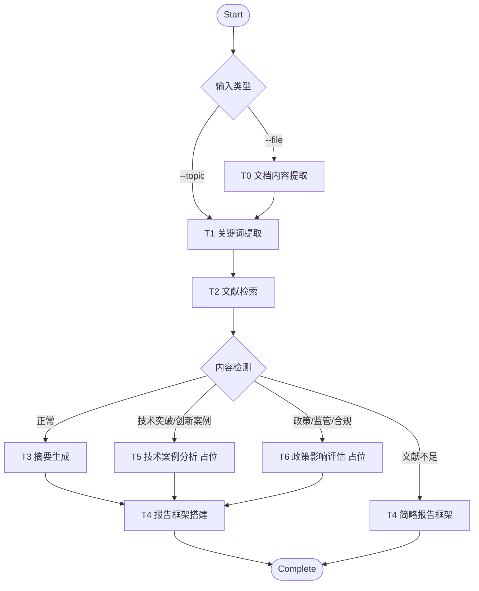

# Lite Agent Orchestrator

轻量级智能体编排原型，当前用于验证“文档输入 -> 任务编排 -> LLM/Mock 处理 -> Markdown 报告输出”的最小闭环。项目后续演进方向是学术文献提炼引擎：高保真解析论文、抽取学术实体、进行多智能体审稿反思，并通过异步 API 对外提供任务服务。

> 当前仓库仍处于原型阶段。后续开发请优先阅读 [README_plan.md](README_plan.md)，其中包含按阶段推进的改造计划和验收标准。

## 当前状态

已经具备的能力：

- CLI 编排入口：`main.py` 支持 `--topic`、`--file`、`--output` 参数。
- T0 文档预处理：可读取外部文件，并生成原始内容与结构化摘要预览。
- T1-T4 基础管道：关键词提取、模拟文献检索、摘要生成、报告框架生成。
- T5/T6 动态分支：根据 T2 文本中是否出现技术突破、政策监管等关键词追加占位任务。
- LLM/Mock 双模式：配置 OpenAI 兼容接口后使用 LLM，未配置时自动回退到 Mock 逻辑。
- 状态持久化：将任务状态写入 `outputs/task_state.json`，支持单任务目录下的断点续跑。
- 多格式文件读取：核心纯文本格式零依赖；PDF、DOCX、XLSX、PPTX、EPUB、RTF、图片 OCR 等通过可选第三方库支持。
- Docker 基础文件：包含 `Dockerfile` 与 `run.sh`。

已知限制：

- 状态管理仍是模块级全局变量，不支持多用户、多 job 并发隔离。
- 文档解析尚未高保真保留 PDF/DOCX 中的公式、表格和版面结构。
- T1/T2/T3 主要返回字符串，尚未形成稳定的结构化数据契约。
- T3 尚未实现 Extractor-Critic-Synthesizer 多智能体审稿反思环路。
- 目前没有 FastAPI 服务层、提交-轮询任务接口、自动化测试与 CI。

## 快速开始

### 1. 准备环境

项目核心逻辑只依赖 Python 标准库。建议使用 Python 3.10+。

```bash
git clone <repo-url>
cd lite-agent-orchestrator
```

如需启用 LLM 增强模式，复制环境变量模板：

```bash
cp .env.example .env
```

然后填写：

```env
OPENAI_API_KEY=your_api_key_here
OPENAI_API_BASE=https://api.deepseek.com/v1
LLM_MODEL=deepseek-chat
```

未配置 `OPENAI_API_KEY` 时，任务会自动进入 Mock 模式。

### 2. 运行 CLI

```bash
python main.py --topic "2025 自动驾驶行业趋势"
python main.py --file ./documents/paper.pdf
python main.py --file ./data/notes.md --topic "AI 安全合规分析" --output outputs/demo
```

输出目录中会生成：

- `task_state.json`：任务状态与状态历史。
- `context_data.json`：各任务节点的上下文产物。
- `resume_log.txt`：启动和续跑记录。
- `report_framework.md`：T4 生成的 Markdown 报告框架。

### 3. 可选文档依赖

核心文本格式无需安装依赖。若要解析更多文件类型，可按需安装：

```bash
pip install pymupdf pdfplumber PyPDF2
pip install python-docx openpyxl python-pptx
pip install odfpy ebooklib striprtf
pip install Pillow pytesseract
```

图片 OCR 还需要本机安装 Tesseract 引擎。

## 当前管道



## 项目结构

```text
lite-agent-orchestrator/
├── main.py                       # CLI 编排入口
├── Dockerfile                    # Docker 构建文件
├── run.sh                        # 容器启动脚本
├── requirements.txt              # 当前声明为零第三方依赖
├── .env.example                  # LLM 环境变量模板
├── README.md                     # 当前项目说明
├── README_plan.md                # 后续演进计划
├── tasks/
│   ├── t0_document_parsing.py    # 文档内容提取
│   ├── t1_keyword_extraction.py  # 关键词提取
│   ├── t2_literature_search.py   # 文献检索
│   ├── t3_summary_generation.py  # 摘要生成
│   └── t4_report_framework.py    # 报告框架生成
└── utils/
    ├── context_manager.py        # 上下文读写
    ├── env_loader.py             # .env 加载
    ├── file_reader.py            # 多格式文件读取
    ├── llm_client.py             # OpenAI 兼容 LLM 客户端
    └── state_manager.py          # 状态持久化
```

后续推进以 `README_plan.md` 为主。

## 目标形态

项目目标不是停留在通用任务编排 demo，而是演进为面向科研/论文阅读场景的学术提炼服务：

- 输入端：高保真解析 PDF/DOCX/TXT/MD，保留公式、表格和章节结构。
- 处理端：抽取 Methods、Datasets、Metrics 等学术实体，形成轻量级知识关联。
- 推理端：通过 Extractor、Critic、Synthesizer 三角色降低摘要幻觉和遗漏。
- 输出端：生成包含核心共识、学术冲突、方法局限和高价值定量指标的 Markdown 报告。
- 服务端：提供 FastAPI 异步提交、状态轮询和结果获取接口。

## 开发原则

- 先保证当前 CLI 原型可运行，再引入 API 和并发能力。
- 先定义结构化数据契约，再扩展 LLM prompt 和外部检索能力。
- Mock 模式必须持续可用，保证没有 API Key 时仍可测试完整流程。
- 可选依赖应显式降级，不让一个文档解析库缺失拖垮整个管道。
- 每个阶段都应补充最小可验证测试，避免计划推进时破坏已有闭环。

## License

MIT License，详见 [LICENSE](LICENSE)。
