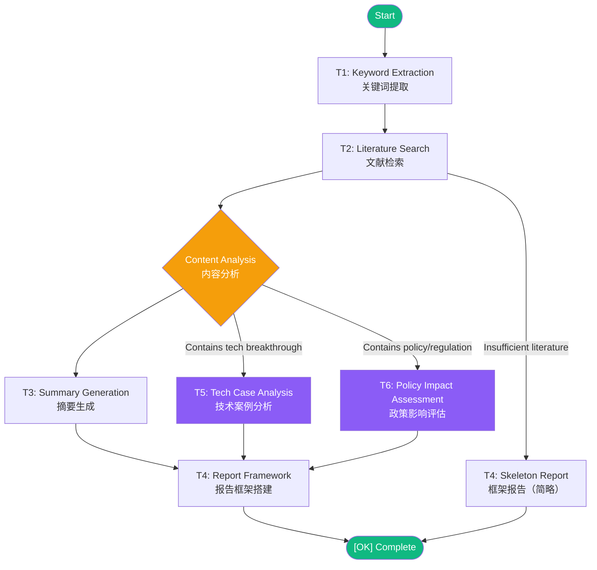

# Lite Agent Orchestrator

**零依赖轻量级智能体编排引擎 | Zero-Dependency Lightweight Agent Pipeline Engine**

> A lightweight, zero-dependency agent task orchestration framework built entirely with Python standard library. Features state persistence, fault-tolerant resume, and dynamic conditional routing.

---

## Key Features | 核心特性

- **Zero Dependencies** — Built entirely with Python standard library, no pip install needed
- **State Persistence & Resume** — JSON-based task state tracking with automatic fault recovery
- **Dynamic Conditional Routing** — Content-aware task branching (T5/T6 injected based on T2 output)
- **LLM-Enhanced Tasks** — Optional LLM integration (DeepSeek/OpenAI compatible) with graceful mock fallback
- **Docker Ready** — One-command containerized deployment

---

## Architecture | 架构



---

## Project Structure | 项目结构

```
lite-agent-orchestrator/
├── main.py          # Main orchestration engine | 主编排引擎
├── test_full.py        # Multi-topic test script | 多主题测试脚本
├── Dockerfile         # Docker deployment | Docker 部署
├── run.sh           # Container entry script | 容器入口脚本
├── requirements.txt      # Dependencies (none!) | 依赖（无！）
├── .env.example        # Environment config template | 环境配置模板
├── LICENSE          # MIT License
├── utils/
│  ├── llm_client.py     # Zero-dep LLM client (DeepSeek/OpenAI) | 零依赖 LLM 客户端
│  ├── env_loader.py     # .env file parser | 环境变量加载器
│  ├── state_manager.py    # Task state persistence & recovery | 任务状态持久化与恢复
│  └── context_manager.py   # Inter-task context passing | 任务间上下文传递
└── tasks/
  ├── t1_keyword_extraction.py
  ├── t2_literature_search.py
  ├── t3_summary_generation.py
  └── t4_report_framework.py
```

---

## Quick Start | 快速开始

### Without LLM (Mock Mode) | 无需 API 密钥

```bash
git clone https://github.com/YOUR_USERNAME/lite-agent-orchestrator.git
cd lite-agent-orchestrator
python main.py
```

### With LLM (Enhanced Mode) | 使用大模型增强

```bash
cp .env.example .env
# Edit .env and add your DeepSeek API key
# 编辑 .env 文件并填入你的 DeepSeek API 密钥
python main.py
```

### Docker

```bash
docker build -t lite-agent .
docker run --env-file .env lite-agent
```

---

## Configuration | 配置说明

| Variable | Description | Default |
|----------|-------------|---------|
| `OPENAI_API_KEY` | API key for LLM service | *(empty, uses mock mode)* |
| `OPENAI_API_BASE` | API base URL | `https://api.deepseek.com/v1` |
| `LLM_MODEL` | Model name | `deepseek-chat` |

---

## State Recovery | 断点续跑

The system automatically saves task progress to `task_state.json`. If the pipeline is interrupted, simply re-run `python main.py` and it will resume from the last completed task.

系统会自动将任务进度保存到 `task_state.json`。如果管道中断，只需重新运行 `python main.py`，系统将从上次完成的任务自动恢复执行。

---

## License

MIT License — see [LICENSE](LICENSE) for details.
