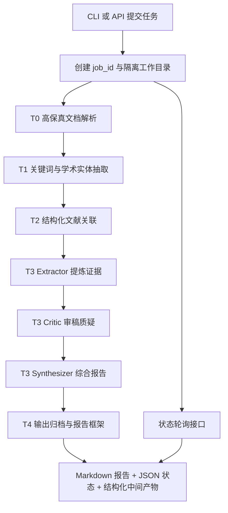

# Lite Agent Orchestrator 改进计划

本文档是后续项目完善的主指导文件。它综合了当前代码审计、`gemini_plan.md` 的高优先级演进方向，以及 `CHANGELOG_deepseek.md` / `CHANGELOG_plan.md` 中记录的历史改动。

参考权重约定：

- 当前代码状态：用于判断“已经实现什么”和“现在会不会运行”，优先级最高。
- `gemini_plan.md`：用于判断目标形态和演进路线，规划优先级最高。
- `CHANGELOG_deepseek.md` 与 `CHANGELOG_plan.md`：用于了解历史改动和近期意图，参考权重中等。
- 旧版 `README.md`：只保留少量项目初始定位信息，参考权重极低。

## 一、项目定位

Lite Agent Orchestrator 的下一阶段目标，是从“零依赖智能体编排 demo”演进为“学术文献提炼引擎”的底层服务。它应能接收论文或研究材料，完成高保真解析、学术实体抽取、结构化文献关联、多智能体审稿反思，并输出可追溯、可复用的 Markdown 学术提炼报告。

目标用户包括：

- 需要快速阅读论文和综述的科研人员。
- 需要比较方法、数据集、指标和局限性的研究助理。
- 需要把学术提炼能力接入其他系统的后端开发者。

非目标：

- 不在早期阶段构建完整论文数据库或重型向量检索平台。
- 不把 LLM 生成的模拟文献伪装成真实检索结果。
- 不优先建设复杂前端，先稳定 CLI、状态、数据契约和 API。

## 二、当前代码审计结论

当前已经存在：

- `main.py`：CLI 管道入口，设计上支持 `--topic`、`--file`、`--output`。
- `tasks/t0_document_parsing.py`：读取外部文件，生成 `raw_content`、文件元信息和 `structured_summary`。
- `tasks/t1_keyword_extraction.py`：LLM/Mock 关键词提取，返回 list。
- `tasks/t2_literature_search.py`：LLM/Mock 文献检索，返回 str。
- `tasks/t3_summary_generation.py`：LLM/Mock 摘要生成，返回 str。
- `tasks/t4_report_framework.py`：LLM/Mock 报告框架生成，返回 Markdown str。
- `utils/file_reader.py`：多格式文件读取器，核心文本格式零依赖，可选支持 PDF、DOCX、XLSX、PPTX、ODF、EPUB、RTF、图片 OCR。
- `utils/state_manager.py`：模块级全局状态文件读写。
- `utils/context_manager.py`：上下文 JSON 读写。
- `utils/llm_client.py`：基于标准库 `urllib` 的 OpenAI 兼容 Chat Completions 客户端。

关键问题：

- `main.py` 当前第一行是 `./"""`，会导致 `SyntaxError`，必须先修复。
- `main.py` 中使用字符串比较判断任务顺序，例如 `next_task <= "T3"`，短期可用但不适合继续扩展。
- `state_manager.py` 使用全局 `OUTPUT_DIR` / `STATE_FILE`，并发任务会相互覆盖。
- `context_manager.py` 也以输出目录文件为中心，缺少 job 级上下文对象。
- T1/T2/T3 缺少稳定 schema，后续 API 和报告质量很难保证。
- `file_reader.py` 能读取多格式文本，但对论文中的公式、表格、章节层级保真不足。
- T5/T6 目前只是占位字符串，不应被视为完整能力。
- 当前 `requirements.txt` 宣称零依赖，但未来 API、测试和高保真解析都需要区分核心依赖与可选依赖。
- 缺少自动化测试、示例输入、端到端 smoke test、异常路径测试。

## 三、目标架构



目标模块：

- `core/pipeline.py`：统一管道执行器，CLI 和 API 共用。
- `core/state.py`：`StateManager(job_id)`，负责任务状态、错误、产物索引。
- `core/context.py`：`ContextStore(job_id)`，负责结构化中间结果。
- `utils/file_reader.py`：继续保留格式读取能力，升级为高保真 Markdown 提取。
- `tasks/`：每个任务定义清晰输入、输出 schema 和 Mock fallback。
- `main.py`：轻量 CLI。
- `main_api.py`：FastAPI 服务入口。
- `tests/`：单元测试、集成测试和 API smoke test。

## 四、阶段路线图

### Phase 0：基线修复与可验证启动

目标：让当前项目回到可运行、可测试、可继续迭代的状态。

任务：

- 修复 `main.py` 第一行语法错误。
- 将任务顺序判断从字符串比较改为索引或显式阶段机。
- 增加 `python -m py_compile main.py tasks/*.py utils/*.py` 的基础检查。
- 增加最小 smoke test：Topic 模式和 TXT 文件模式各跑通一次。
- 明确 `.gitignore` 是否忽略 `outputs/`、`__pycache__/`、本地 `.env`。
- 更新 `requirements.txt`：保留核心零依赖说明，同时新建可选依赖说明，例如 `requirements-optional.txt` 或 README 中的 optional install 段落。

验收标准：

- `python main.py --help` 成功。
- `python main.py --topic "AI safety"` 能生成 `outputs/report_framework.md`。
- 使用一个临时 `.txt` 文件运行 `--file` 能完成 T0-T4。
- 无 API Key 时 Mock 模式完整可用。

### Phase 1：高保真解析与 job 级状态隔离

目标：为后续 API 并发打地基，同时提升论文解析质量。

任务：

- 将 `utils/state_manager.py` 重构为 `StateManager` 类。
- 每个实例绑定唯一 `job_id`，状态写入 `outputs/jobs/{job_id}/task_state.json`。
- 状态中记录 `job_id`、`status`、`current_task`、`created_at`、`updated_at`、`error`、`task_list`。
- 提供线程安全写入机制，至少保证单进程多线程下不会交叉覆盖。
- 将 `context_manager.py` 重构为 job 级 `ContextStore`，写入 `outputs/jobs/{job_id}/context_data.json`。
- 升级 T0 输出，至少包含 `raw_text`、`markdown_text`、`metadata`、`warnings`。
- 增强 PDF/DOCX 表格处理，优先输出 Markdown 表格。
- 对公式保留采用渐进策略：能识别 LaTeX 就保留，不能识别时不得编造公式。

建议输出契约：

```json
{
  "raw_text": "...",
  "markdown_text": "...",
  "metadata": {
    "file_name": "paper.pdf",
    "file_type": ".pdf",
    "file_size": 12345,
    "parser": "pdfplumber"
  },
  "warnings": []
}
```

验收标准：

- 两个不同 `job_id` 同时运行时，状态与上下文文件互不覆盖。
- PDF 缺少可选依赖时返回清晰错误或 warning，不造成整个进程崩溃。
- DOCX 表格能以 Markdown 或结构化文本形式进入 T0 输出。

### Phase 2：学术实体抽取与轻量级知识关联

目标：把 T1/T2 从普通字符串任务升级为结构化学术分析任务。

任务：

- T1 同时输出关键词与学术实体。
- 学术实体包含 `methods`、`datasets`、`metrics`、`tasks`、`domains`，可选 `relations`。
- LLM 输出必须要求 JSON；实现健壮 JSON 解析与 fallback。
- Mock 模式也返回同样 schema，避免下游分支处理两套类型。
- T2 基于关键词和实体生成结构化文献候选列表。
- 为未来真实检索预留 provider 接口，例如 `LiteratureProvider`，早期可只有 `MockLiteratureProvider` 和 `LLMSimulatedProvider`。
- 明确 simulated literature 必须标注 `source_type: "simulated"`，避免被误当真实引用。

建议 T1 输出：

```json
{
  "keywords": ["large language model", "evaluation"],
  "academic_entities": {
    "methods": ["Transformer"],
    "datasets": ["MMLU"],
    "metrics": ["Accuracy"],
    "tasks": ["benchmark evaluation"],
    "domains": ["NLP"],
    "relations": [
      {"source": "Transformer", "relation": "evaluated_on", "target": "MMLU"}
    ]
  }
}
```

建议 T2 输出：

```json
{
  "literature_results": [
    {
      "title": "...",
      "authors": ["..."],
      "year": 2024,
      "core_method": "...",
      "datasets": ["..."],
      "metrics": ["..."],
      "key_findings": ["..."],
      "limitations": ["..."],
      "source_type": "simulated",
      "url": null
    }
  ]
}
```

验收标准：

- T1/T2 在 LLM 与 Mock 模式下返回同构 JSON。
- 下游 T3 不再依赖自然语言字符串中是否包含某个关键词来判断主要逻辑。
- JSON 解析失败时有明确错误记录，并能使用 Mock fallback 继续运行。

### Phase 3：Extractor-Critic-Synthesizer 审稿反思环路

目标：让 T3 从普通摘要升级为带审稿质疑的学术提炼模块。

任务：

- 将 T3 内部分为三个角色：
  - `Extractor Agent`：从 T0/T2 中提取技术路线、实验设置、指标、结论和证据片段。
  - `Critic Agent`：指出证据不足、样本量问题、选择性报告、结论冲突和潜在幻觉。
  - `Synthesizer Agent`：综合前两者输出最终 Markdown 报告。
- 每个角色的 prompt 单独维护，便于测试和迭代。
- T3 输出同时保存 Markdown 报告和结构化审稿信息。
- 报告必须区分“文档中明确出现”“由多文献支持”“模型推断/待验证”。
- 不允许无来源地编造定量指标或公式；不能确认时写入“未在输入中发现可验证公式/指标”。

最终报告必须包含：

- `核心共识`
- `学术冲突`
- `方法局限`
- `高价值定量指标`
- `证据与不确定性`

验收标准：

- 给定同一份输入，T3 产物包含 extractor draft、critic review、final report 三份中间结果。
- Critic 至少输出 2 条可操作质疑或说明“输入证据不足，无法提出有效质疑”的原因。
- 最终 Markdown 不把 simulated literature 表述成真实已检索论文。

### Phase 4：FastAPI 异步服务层

目标：提供可集成的后端服务，支持提交任务、轮询状态和获取报告。

任务：

- 新增 `main_api.py`。
- 增加 `/api/v1/jobs/submit`：
  - 支持上传 PDF/TXT/MD/DOCX 等文件。
  - 创建 `job_id`。
  - 将原始文件保存到 `outputs/jobs/{job_id}/input/`。
  - 后台启动 T0-T3/T4 管道。
- 增加 `/api/v1/jobs/status/{job_id}`：
  - 返回 job 状态、当前任务、进度、错误信息。
  - 完成后返回报告路径或报告摘要。
- 增加 `/api/v1/jobs/result/{job_id}`：
  - 返回最终 Markdown 报告和结构化产物索引。
- CLI 与 API 共享同一个 pipeline runner，避免逻辑分叉。
- 增加 `test_api_client.py` 或 pytest API 测试。

建议状态枚举：

- `PENDING`
- `PROCESSING`
- `COMPLETED`
- `FAILED`
- `CANCELLED`，可后置实现

验收标准：

- 两个并发上传任务可同时运行，互不覆盖。
- 轮询接口能显示当前节点，例如 `T2 literature_search`。
- 任务失败时状态文件记录异常类型、错误消息和失败节点。

### Phase 5：质量体系与可维护性

目标：让项目可以被多轮 agent 稳定接手。

任务：

- 增加 `tests/`。
- 为 `file_reader`、`StateManager`、`ContextStore`、T1 JSON 解析、T2 provider、T3 report schema 编写单元测试。
- 增加端到端 smoke tests。
- 增加日志模块，替代散落的 `print`。
- 统一错误类型，例如 `DocumentParseError`、`LLMResponseError`、`PipelineStateError`。
- 增加最小 CI 配置，运行格式检查、编译检查和测试。
- 给典型输入建立 `examples/`，不要提交真实敏感论文。

验收标准：

- 新增功能必须有对应测试或 smoke 验证说明。
- 文档中每条 Quick Start 都能在干净环境中执行。
- Mock 模式覆盖完整链路，CI 不依赖外部 LLM 服务。

### Phase 6：产品化与部署

目标：把服务从本地原型推进到可部署组件。

任务：

- 更新 Dockerfile，区分 CLI 和 API 启动方式。
- 增加 `docker-compose.yml` 示例。
- 明确上传文件大小限制、允许的扩展名、输出目录清理策略。
- 增加 API 鉴权预留位，至少支持简单 token。
- 增加任务保留时间和过期清理。
- 输出报告增加可下载 Markdown 文件。

验收标准：

- Docker 中可启动 API 服务。
- 文档给出完整 submit/status/result 示例。
- 大文件、空文件、错误格式、缺少 API Key 都有可预期响应。

## 五、推荐数据契约

### Job 状态

```json
{
  "job_id": "20260613-abcdef",
  "status": "PROCESSING",
  "current_task": "T2",
  "created_at": "2026-06-13T10:00:00+08:00",
  "updated_at": "2026-06-13T10:01:00+08:00",
  "error": null,
  "task_list": [
    {
      "task_id": "T0",
      "task_name": "document_parsing",
      "status": "COMPLETED",
      "started_at": "...",
      "finished_at": "...",
      "error": null
    }
  ],
  "artifacts": {
    "context": "context_data.json",
    "report": "report.md"
  }
}
```

### 上下文键

建议统一使用稳定键名：

- `document_parse`
- `keyword_entities`
- `literature_results`
- `extractor_draft`
- `critic_review`
- `final_report`
- `report_framework`

不要继续依赖 `T1_output` 这类只表达任务编号、不表达语义的键名作为长期接口。

## 六、工程约束

- Mock fallback 是一等公民，不能因为接入 LLM 或 API 而失效。
- LLM 结果必须经过 schema 校验，不能直接透传给下游核心逻辑。
- 对真实检索与模拟检索做显式标注。
- 解析器可以使用可选依赖，但缺依赖时要给出清晰降级路径。
- 任何涉及并发的功能必须以 job_id 隔离状态、上下文和输入文件。
- 后续 agent 修改计划时，应同步更新本文件，不再把临时 changelog 当主计划。

## 七、优先级建议

最高优先级：

- 修复启动问题。
- 重构 job 级状态和上下文。
- 定义 T1/T2/T3 结构化输出。

中高优先级：

- 高保真 PDF/DOCX 解析。
- Extractor-Critic-Synthesizer 审稿环路。
- API submit/status/result。

中优先级：

- 可选依赖管理。
- 测试体系。
- Docker API 部署。

暂缓：

- 重型 GraphRAG、向量数据库、复杂前端、多租户权限系统。
- 真实学术数据库接入，除非已经完成 source 标注、错误处理和缓存策略。

## 八、下一位开发 agent 的建议执行顺序

1. 先完成 Phase 0，确保项目能跑。
2. 再做 Phase 1，不要在全局状态上直接堆 FastAPI。
3. 完成 T1/T2 schema 后再改 T3，否则审稿环路会建立在不稳定输入上。
4. API 层只调用稳定 pipeline，不复制 CLI 逻辑。
5. 每阶段结束后更新 README、README_plan 和最小测试说明。
